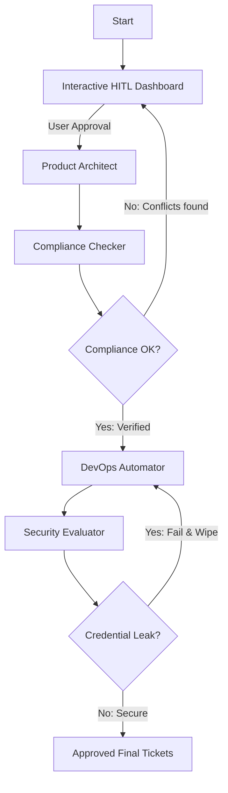

# Spec-to-Ticket Codebase Alignment Agent 🛠️🎟️

A production-grade multi-agent workflow orchestrator designed under the **Agents for Business** track using **Google ADK 2.0** and the **Google GenAI SDK**. 

This system bridges the gap between high-level feature requirements and concrete codebase realities by automatically scanning the repository, checking endpoint/schema compliance via local MCP servers, auditing for security vulnerabilities, and generating formatted Jira/Linear/Github-ready DevOps ticket cards.

---

## 🏗️ Architectural Overview

The agent cluster executes a stateful, cyclic workflow with strict guardrails:



### Key Modules:
1. **Interactive HITL Gate (`human_validation_node`)**: Renders a rich console execution roadmap with token metric calculations and prompts the user for approval or feedback.
2. **Product Architect Agent**: Converts user feature requirements into a comprehensive technical Markdown PRD.
3. **Compliance Checker Agent**: Interacts with a local FastMCP server to scan repository structures and analyze database models/endpoint definitions for conflicts.
4. **DevOps Automator Agent**: Maps technical specifications into actionable developer ticketing task cards.
5. **Security Evaluator (LLM-as-a-Judge)**: Audits the final DevOps tickets to prevent credentials or sensitive configuration leaks (safeguarding against CWE-200 / OWASP Top 10 for LLMs). If a leak is found, it wipes the state and triggers regeneration.

---

## 🛠️ Tech Stack & Dependencies

* **Core Framework**: Google ADK 2.0
* **API SDK**: Google GenAI SDK (utilizing `gemini-2.5-flash`)
* **Tool Server**: FastMCP (Python-based Model Context Protocol server)
* **Console UI**: Rich (for high-fidelity dashboard components, panel interfaces, and real-time state logs)
* **Environment**: `python-dotenv` (configured with strict override rules to resolve environment credentials securely)

---

## 🚀 Getting Started

### 1. Prerequisites
Ensure you have Python 3.11+ installed. We recommend using a virtual environment.

### 2. Installation
Clone the repository, navigate to the project directory, and install dependencies:
```bash
python -m venv .venv
source .venv/bin/activate
pip install -r requirements.txt
```

### 3. Environment Setup
Configure your environment variables by creating a `.env` file in the root directory:
```env
# Google AI Studio API Key (Ensure standard/AQ prefixes are used)
GEMINI_API_KEY=your_gemini_api_key_here

# Target Issue Tracker Access Token (e.g., GitHub Personal Access Token)
ISSUE_TRACKER_TOKEN=your_github_token_here
```

---

## ⚡ Execution

### Running the Live Multi-Agent Workflow
Execute the live workflow directly using the virtual environment interpreter:
```bash
.venv/bin/python agent.py
```
> **Security Protection**: The workspace path is locked automatically to your project directory. Personal folders (such as Downloads, Desktop, or iCloud) are completely bypassed to prevent unnecessary sandbox permission prompts.


---

## 🛡️ Robust State Recovery Features
* **ADK 2.0 State Recovery Hook**: A specialized `before_agent_callback` (`hydrate_state_from_events`) traverses the session history event stream to recover payload variables, preventing parameter drops across node transitions.
* **Environment Overrides**: `load_dotenv` is configured to run in `override=True` mode, ensuring that the API credentials in your `.env` file are always prioritized over conflicting global shell environment variables.
